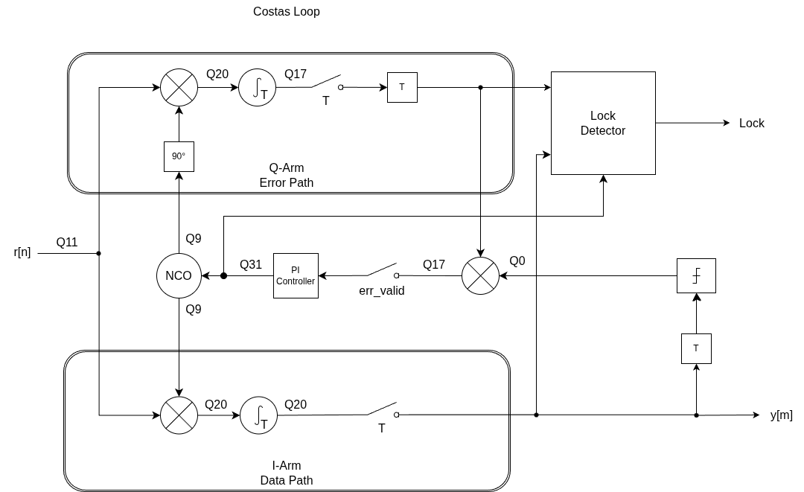

= Locutus MSK Modem: Symbol Synchronization Lock
Matthew Wishek, NB0X <matthew@wishek.com>
0.2 February 2, 2026
:icons: font
:stem: latexmath
:eqnums:

== Summary

Synchronization detection is an important metric for communications systems. It provides a mechanism to qualify received data as invalid or possibly valid. That is, if synchronization is unlocked the received data is invalid, and if locked data is likely valid. Additionally, lock signal at various levels in the hierarchy are especially useful in diagnosing misbehaving communication links. Here we review the synchronization lock detection in the Locutus MSK Modem/PHY.

== OSI 7-Layer Model

The OSI (Open Systems Interconnect) Seven Layer model provides a framework for describing and standardizing network communication functions into layers. The figure below shows the seven layers and how computer networking functions map to each layer.

.OSI Seven Layer Model 
[%autowidth]
|====================
| 7. Application Layer  |  User interface, HTTP, FTP, etc
| 6. Presentation Layer |  Data formatting, encryption, compression
| 5. Session Layer      |  Session Management
| 4. Transport Layer    |  End-to-end connections - TCP, UDP
| 3. Network Layer      |  Routing - logical addressing (IP)
| 2. Data Link Layer    |  Point-to-Point - Ethernet II Frames using MAC addressing
| 1. Physical Layer     |  Physical medium - cables, radio waves
|====================

== Symbol/Bit Lock in Ethernet

When an Ethernet cable is connected between two devices there is an indiction that the link is active via an LED on the device connector. When the cable is plugged into the first device LED does not light as the link is not yet active. When the cable is then plugged into the second device we see the LED on both devices will turn on. This is a form of Layer 1 / PHY symbol lock.

When the second connection is made the Ethernet PHY chips at each end start receiving a signal from the other end, they then negotiate link parameters like link speed (e.g. 10 Mbps, 100 Mbps, 1000 Mbps). Once the negotiation is complete the PHY chip will light the LED.

== OSI Model as Applied to Opulent Voice and the Locutus MSK Modem

The OSI model can be applied to any communications system. Some layers may not be used, or may be merged, but the framework is still useful. The table below shows the two lower layers of the OSI model as applied to the OPV stack using the Locutus MSK Modem. 

.PHYs and Modems
****
Note here that the Ethernet PHY chip mentioned previously is a modem of sorts that takes Layer 2 data frames and converts the frame bits into signals transmitted across the Ethernet cable. The Locutus MSK Modem does the same taking Layer 2 frames (any Layer 2 frame, not necessarily Ethernet II frames) and converts the frame bits into signals transmitted across space using radio waves. So we can use the terms PHY and Modem interchangeably, although we will use Modem for the remainder of this discussion.
****

.OSI Seven Layer Model 
[%autowidth,options="header"]
|====================
| Layer | Name | OPV Function
| 2 | DataLink Layer    | Opulent Voice Frame
| 1 | PHY Layer         | MSK Modem/PHY
|====================

In the Opulent Voice system the MSK Modem is equivalent to the Ethernet PHY Layer and the Opulent Voice frame is equivalent to an Ethernet II frame. Now let us consider how synchronization locks are applied in this system.

== Symbol Locks and Frame Locks

=== Layer 2 OPV Frame Sync Lock

The OPV frame has a synchronization preamble that is detected at the receiver. Frame synchronization is necessary to identify the start of incoming OPV frames which allows the frames to be decoded. The decoder only starts decoding when frame synchronization is detected, and we call this state __frame sync lock__. The frame synchronization detector continues to detect the frame sync preamble for every frame, and if it doesn't detect the frame sync at the start of the next frame __frame sync unlock__ is declared, after which the frame decoder will stop decoding frames, as the received data is undefined.

=== Layer 1 MSK Modem Symbol Lock

The MSK transmitter takes the incoming bits of the OPV frame and translates them into I/Q symbols that are then transmitted over the wireless radio link. The MSK receiver has to then __lock__ to the received symbols. This process is done using a _Phase-Lock Loop_ (PLL) that detects and synchronizes to the incoming radio waves. Once the PLL achieves synchronization __symbol sync lock__ is declared and the received symbols are converted back the bits making up the OPV frame.

The __symbol sync lock__ from the MSK receiver is an important qualifier to the OPV frame decoder. If the OPV framer decoder is receiving invalid bits because we don't have symbol lock then the frame sync detector will be trying to lock to invalid bits from the MSK receiver. The detector might incorrectly detect random bits as a frame sync. This results in the frame detector assuming that it has found a frame sync and will look for the sync again at the next frame. That the data is invalid can cause the frame sync detector to miss the real frame once the MSK receiver achieves symbol lock. This isn't a fatal condition, but it will mean that one or more OPV frames are lost while the frame synchronizer recovers. The frame synchronizer uses the MSK receiver symbol lock status as a gating signal to only start frame detection once symbol lock achieved.

== Locutus MSK Symbol Synchronization

=== Costas Loop

The MSK receiver uses two Costas Loops to detect the F1 and F2 frequencies used in MSK modulation. The Costas loop is a form of Phase-Locked Loop. The following diagram shows one of the Costas loops in the MSK receiver.

.Image Costas Loop PLL for MSK Receiver

The received MSK signal consists of a cosine wave that switches between two frequencies latexmath:[f_1] and latexmath:[f_2]. For the current discussion let examine one input frequency latexmath:[f_x].

The Costas loop takes the received signal and sends it to two "arms", the I (in-phase) and Q (quadrature-phase). The Costas loop then attempts to lock to the frequency and phase of the incoming signal.

=== In-Phase Arm

The I arm mixes the incoming signal with the NCO cosine output and accumulates mixer output over 1 bit time (latexmath:[T_b]). The incoming signal is:

[latexmath]
++++
r_n = \cos(2\pi f_x n)
++++

We expect that the NCO signal has both a frequency and phase offset from the incoming signal:

[latexmath]
++++
nco_{i,n} = \cos(\theta_{nco_n}) = \cos(2\pi (f_x + \Delta f) n + \theta)
++++

where latexmath:[\theta_{nco}] is the NCO phase output, latexmath:[\Delta f] is the frequency offset, and latexmath:[\theta] is the phase offset.

The mixer output latexmath:[mix_i] is:

[latexmath]
++++
\begin{align*}
mix_{i,n} & = r_n \cdot nco_{i,n} \\
        & = \cos(2\pi f_x n) \cdot \cos(2\pi (f_x + \Delta f) n + \theta) \\
		& = \frac{1}{2} [ \cos(2\pi f_x n - 2\pi (f_x + \Delta f) n - \theta) + \cos(2\pi f_x n + 2\pi (f_x + \Delta f) n + \theta) ] \\
		& = \frac{1}{2} [ \cos(-2\pi \Delta f n - \theta) + \cos(4\pi (f_x + \frac{1}{2} \Delta f) n + \theta)]
\end{align*}
++++

The first term is near DC and it the signal of interest. The second term is near latexmath:[4f_x] and can be disregarded.

// [TODO - Why can it be disregarded?]. 
// When accumulating the second term can be disregarded as it is a multiple of a full cosine wave, so the only energy accumulated is at most 1/4 to 1/2 of a single cycle. The simplified accumulation is:

The mixer output is then accumulated over latexmath:[T_b] to produce the accumulator output for bit latexmath:[k]. 

[latexmath]
++++
acc_{i,k} = \sum_{n=kN}^{((k+1)N)-1} \frac{1}{2} [ \cos(-2\pi \Delta f n - \theta)]
++++

where latexmath:[N] is the number of samples in a bit period, such that latexmath:[N = T_b/F_s] where latexmath:[F_s] is the system sample rate.

When the loop is unlocked the accumulation for bit latexmath:[k] is

[latexmath]
++++
0 \lt acc_{i,k} \lt \frac{1}{2} N
++++

Let's assume the accumulation mean will be

[latexmath]
++++
\bar{\text{acc}}_{i,k} \approx \frac{1}{4} N
++++

with a large variance.

When the loop is locked then latexmath:[\Delta f \approx 0] and latexmath:[\theta \approx 0] which simplifies the accumulation to:

[latexmath]
++++
\begin{align*}
acc_{i,k} & \approx \sum_{n=kN}^{((k+1)N)-1} \frac{1}{2} [ cos(2\pi \Delta f_{res} n + \theta_{res})] \\
       & \approx \frac{1}{2} N
\end{align*}
++++

where latexmath:[\Delta f_{res}] is the residual frequency error and latexmath:[\theta_{res}] is the residual phase error, which will both be close to 0.

=== Quadrature Phase Arm

The Q arm computes an error signal that adjust the NCO frequency via a PI controller. This arm works similarly to the I arm where the incoming signal latexmath:[r_n] is mixed with the sine output from the NCO (90 degree phase shift from the I arm).

[latexmath]
++++
\begin{align*}
nco_{q,n} & = sin(\theta_{nco_n}) \\
\\

q_{mix} & = r_n \cdot nco_{q,n} \\
        & = \sin(2\pi f_x n) \cdot \sin(2\pi (f_x + \Delta f) n + \theta) \\
		& = \frac{1}{2} [ \sin(2\pi f_x n + 2\pi (f_x + \Delta f) n + \theta) - \sin(2\pi f_x n - 2\pi (f_x + \Delta f) n - \theta) ] \\
		& = \frac{1}{2} [ \sin(4\pi (f_x + \frac{1}{2} \Delta f) n + \theta) - \sin(2\pi \Delta f n - \theta) ]
\end{align*}
++++

As with the I arm, the term near DC is of interest and the term near latexmath:[4f_x] can be disregarded. The accumulation is now:

[latexmath]
++++
acc_{q,k} = \sum_{n=kN}^{((k+1)N)-1} \frac{1}{2} [ -\sin(2\pi \Delta f n - \theta)]
++++

We can see again that when the loop is unlocked 

[latexmath]
++++
0 \lt acc_{q,k} \lt -\frac{1}{2} N
++++

And let us assume the accumulation mean will be

[latexmath]
++++
\bar{\text{acc}}_{q,k} \approx -\frac{1}{4} N
++++

with a large variance.

And when the loop is locked latexmath:[\Delta f \approx 0] and latexmath:[\theta \approx 0] resulting in the accumulated value being:

[latexmath]
++++
\begin{align*}
acc_{q,k} & = \sum_{n=kN}^{((k+1)N)-1} \frac{1}{2} [ -\sin(2\pi \Delta F_{res} n + \theta_{res})] \\
      & \approx 0
\end{align*}
++++

=== Symbol Sync Lock Detection

The accumulated values on both the I arm and Q arm provide a useful signal to detect symbol lock. When the loop is unlocked we can say:

[latexmath]
++++
acc_i \approx acc_q
++++

And when the loop is locked:

[latexmath]
++++
acc_i \gg acc_q
++++

The signs of the latexmath:[acc_i] and latexmath:[acc_q] may differ, we cannot do a simple comparison, so we can square them then take the difference:

[latexmath]
++++
T_{ms} = acc_i^2 - acc_q^2
++++

When the loop is unlocked latexmath:[T_{ms}] will be closer to 0, and when locked latexmath:[T_{ms}] will be closer to latexmath:[acc_i^2]. Since there is ambiguity we can use a programmable threshold latexmath:[T_{th}] to set the final lock detection:

[latexmath]
++++
lock = T_{ms} > T_{th}
++++

== Summary

Lock status from each layer of the OSI modem can be an indication to the higher layers whether the incoming data is valid or not. While system can function just fine with proper data/frame detection techniques using the relevant loc indicators can impove system robustness and may be necessary to meet system requirements.

